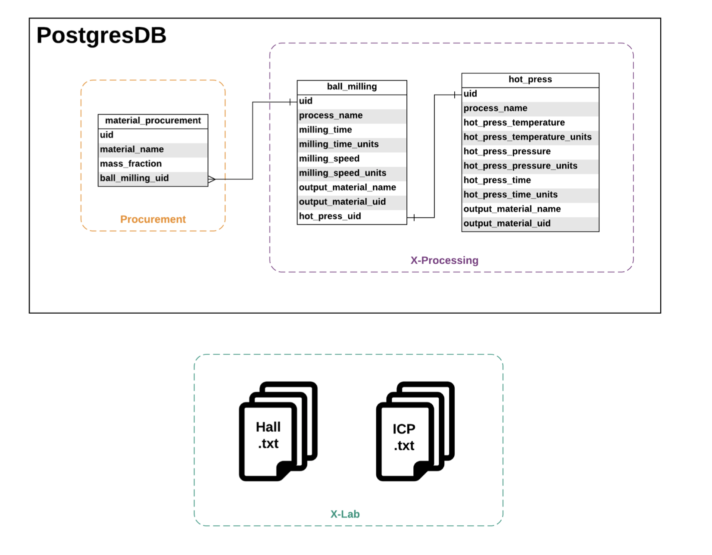
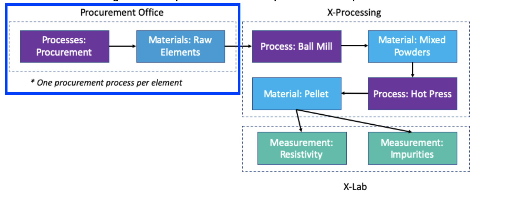
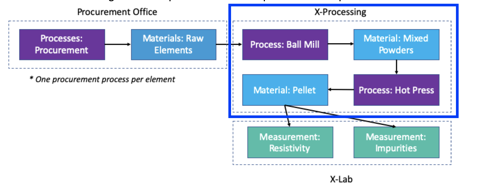
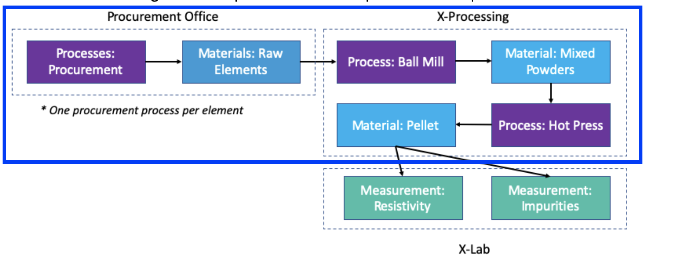
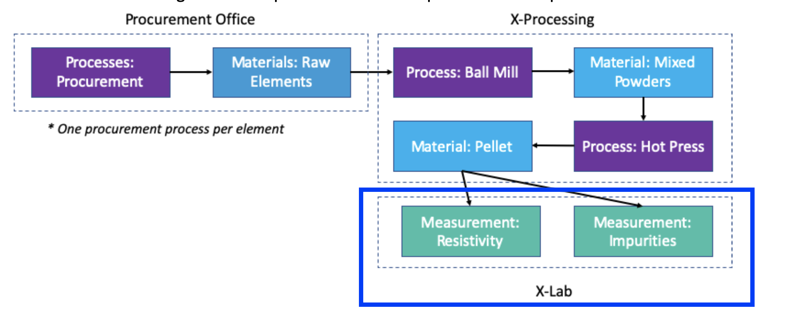
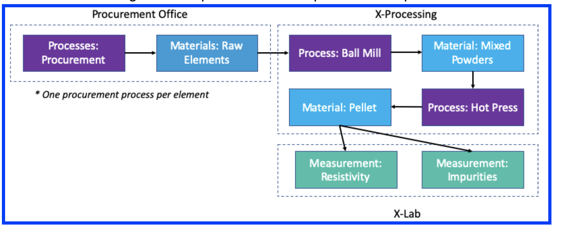

# Source Data



# Single Data Management Solution

The Single Data Management Solution is to generate a master CSV in which each entry of the csv represents the results and metadata of a material specimen. Each material specimen is uniquely identified by it's process (ball milling id / hot press id) and the form at which it was tested (Mixed Powders or Pellet). The major assumption in this data model is that there are no repeat measurements (i.e. single measurement for unique combination of raw material, process condition, and measurement form). If there were repeat measurements then a single measurement could be uniquely identified by an id given at test time or timestamp.


```python
import psycopg2
import pandas as pd
import os
import re

import config
from extract import extract_table_to_df, extract_xlabtxt_to_df, extract_xlabtxts_to_df
from transform import set_df_col_names, flatten_cols, strip_col_whitespace
```

Configuration variables for my local version of x-materials-database are given in config.py. These will need to be replaced with your own configuration variables.


```python
#Create connection with Postgres Database
connection = psycopg2.connect(host=config.DB_HOST, database=config.DB_NAME, \
                              user=config.DB_USER, password=config.DB_PASS)
```

# Gather Historical Raw Data and Pipe Into Master CSV

Task Dependencies: <br>
Create Procurement DataFrame >> Create X-Processing DataFrame >> Merge Procurement Office DataFrame with X-Processing DataFrame >> Merge X-Lab DataFrames with Procurement and Processing DataFrame
<< Create XLab DataFrames

### Create Procurement DataFrame




```python
df_material_procurement_cols = ['Cu_uid', 'Se_uid', 'Zn_uid', 'Cu_mass_fraction', \
                               'Se_mass_fraction', 'Zn_mass_fraction']

#pivot table so that ball_milling_uid becomes unique identifier
df_material_procurement = (
                            extract_table_to_df("material_procurement", connection)
                            .pivot(index="ball_milling_uid", columns="material_name")
                            .pipe(flatten_cols)
                            .pipe(set_df_col_names, df_material_procurement_cols)
                          )
```


```python
df_material_procurement.head()
```


<div>
<table border="1" class="dataframe">
  <thead>
    <tr style="text-align: right;">
      <th></th>
      <th>Cu_uid</th>
      <th>Se_uid</th>
      <th>Zn_uid</th>
      <th>Cu_mass_fraction</th>
      <th>Se_mass_fraction</th>
      <th>Zn_mass_fraction</th>
    </tr>
    <tr>
      <th>ball_milling_uid</th>
      <th></th>
      <th></th>
      <th></th>
      <th></th>
      <th></th>
      <th></th>
    </tr>
  </thead>
  <tbody>
    <tr>
      <th>MATX-BM001</th>
      <td>MATX-PR-002</td>
      <td>MATX-PR-003</td>
      <td>MATX-PR-001</td>
      <td>0.92</td>
      <td>0.06</td>
      <td>0.02</td>
    </tr>
    <tr>
      <th>MATX-BM002</th>
      <td>MATX-PR-005</td>
      <td>MATX-PR-006</td>
      <td>MATX-PR-004</td>
      <td>0.90</td>
      <td>0.06</td>
      <td>0.04</td>
    </tr>
    <tr>
      <th>MATX-BM003</th>
      <td>MATX-PR-008</td>
      <td>MATX-PR-009</td>
      <td>MATX-PR-007</td>
      <td>0.88</td>
      <td>0.06</td>
      <td>0.06</td>
    </tr>
    <tr>
      <th>MATX-BM004</th>
      <td>MATX-PR-011</td>
      <td>MATX-PR-012</td>
      <td>MATX-PR-010</td>
      <td>0.86</td>
      <td>0.06</td>
      <td>0.08</td>
    </tr>
    <tr>
      <th>MATX-BM005</th>
      <td>MATX-PR-014</td>
      <td>MATX-PR-015</td>
      <td>MATX-PR-013</td>
      <td>0.84</td>
      <td>0.06</td>
      <td>0.10</td>
    </tr>
  </tbody>
</table>
</div>


### Create X-Processing DataFrame




```python
df_ball_milling_cols = ['ball_milling_uid', 'ball_milling_process_name', 'milling_time', 'milling_time_units', \
                       'milling_speed', 'milling_speed_units', 'ball_milling_output_material_name', \
                       'ball_milling_output_material_uid', 'hot_press_uid']

df_hot_press_cols = ['hot_press_uid', 'hot_press_process_name', 'hot_press_temperature', 'hot_press_temperature_units', \
               'hot_press_pressure', 'hot_press_pressure_units', 'hot_press_time', 'hot_press_time_units', \
               'hot_press_output_material_name', 'hot_press_output_material_uid']


df_ball_milling = (
                    extract_table_to_df("ball_milling", connection)
                    .pipe(set_df_col_names, df_ball_milling_cols)
                    
                  )

df_hot_press = (
                    extract_table_to_df("hot_press", connection)
                    .pipe(set_df_col_names, df_hot_press_cols)
                    
               )


#Merge df_ball_milling and df_hot_press into df_processing
df_processing = df_ball_milling.merge(df_hot_press, on='hot_press_uid')
```


```python
df_processing.head()
```


<div>
<table border="1" class="dataframe">
  <thead>
    <tr style="text-align: right;">
      <th></th>
      <th>ball_milling_uid</th>
      <th>ball_milling_process_name</th>
      <th>milling_time</th>
      <th>milling_time_units</th>
      <th>milling_speed</th>
      <th>milling_speed_units</th>
      <th>ball_milling_output_material_name</th>
      <th>ball_milling_output_material_uid</th>
      <th>hot_press_uid</th>
      <th>hot_press_process_name</th>
      <th>hot_press_temperature</th>
      <th>hot_press_temperature_units</th>
      <th>hot_press_pressure</th>
      <th>hot_press_pressure_units</th>
      <th>hot_press_time</th>
      <th>hot_press_time_units</th>
      <th>hot_press_output_material_name</th>
      <th>hot_press_output_material_uid</th>
    </tr>
  </thead>
  <tbody>
    <tr>
      <th>0</th>
      <td>MATX-BM001</td>
      <td>high energy ball milling</td>
      <td>15.0</td>
      <td>hr</td>
      <td>200.0</td>
      <td>rpm</td>
      <td>powder</td>
      <td>MATX-BM-M001</td>
      <td>MATX-HP001</td>
      <td>Hot Isostatic Press</td>
      <td>850.0</td>
      <td>degC</td>
      <td>100.0</td>
      <td>MPa</td>
      <td>1.0</td>
      <td>hr</td>
      <td>final pellet</td>
      <td>MATX-HP-M001</td>
    </tr>
    <tr>
      <th>1</th>
      <td>MATX-BM002</td>
      <td>high energy ball milling</td>
      <td>30.0</td>
      <td>hr</td>
      <td>200.0</td>
      <td>rpm</td>
      <td>powder</td>
      <td>MATX-BM-M002</td>
      <td>MATX-HP002</td>
      <td>Hot Isostatic Press</td>
      <td>850.0</td>
      <td>degC</td>
      <td>200.0</td>
      <td>MPa</td>
      <td>0.5</td>
      <td>hr</td>
      <td>final pellet</td>
      <td>MATX-HP-M002</td>
    </tr>
    <tr>
      <th>2</th>
      <td>MATX-BM003</td>
      <td>high energy ball milling</td>
      <td>45.0</td>
      <td>hr</td>
      <td>200.0</td>
      <td>rpm</td>
      <td>powder</td>
      <td>MATX-BM-M003</td>
      <td>MATX-HP003</td>
      <td>Hot Isostatic Press</td>
      <td>900.0</td>
      <td>degC</td>
      <td>100.0</td>
      <td>MPa</td>
      <td>1.0</td>
      <td>hr</td>
      <td>final pellet</td>
      <td>MATX-HP-M003</td>
    </tr>
    <tr>
      <th>3</th>
      <td>MATX-BM004</td>
      <td>high energy ball milling</td>
      <td>60.0</td>
      <td>hr</td>
      <td>200.0</td>
      <td>rpm</td>
      <td>powder</td>
      <td>MATX-BM-M004</td>
      <td>MATX-HP004</td>
      <td>Hot Isostatic Press</td>
      <td>900.0</td>
      <td>degC</td>
      <td>200.0</td>
      <td>MPa</td>
      <td>0.5</td>
      <td>hr</td>
      <td>final pellet</td>
      <td>MATX-HP-M004</td>
    </tr>
    <tr>
      <th>4</th>
      <td>MATX-BM005</td>
      <td>high energy ball milling</td>
      <td>15.0</td>
      <td>hr</td>
      <td>225.0</td>
      <td>rpm</td>
      <td>powder</td>
      <td>MATX-BM-M005</td>
      <td>MATX-HP005</td>
      <td>Hot Isostatic Press</td>
      <td>1000.0</td>
      <td>degC</td>
      <td>100.0</td>
      <td>MPa</td>
      <td>1.0</td>
      <td>hr</td>
      <td>final pellet</td>
      <td>MATX-HP-M005</td>
    </tr>
  </tbody>
</table>
</div>


### Merge Procurement Office DataFrame with X-Processing DataFrame




```python
#Merge X-Processing DataFrame with Procurement Office DataFrame
df_procurement_processing = df_processing.merge(df_material_procurement, on='ball_milling_uid')
```


```python
df_procurement_processing.head()
```


<div>
<table border="1" class="dataframe">
  <thead>
    <tr style="text-align: right;">
      <th></th>
      <th>ball_milling_uid</th>
      <th>ball_milling_process_name</th>
      <th>milling_time</th>
      <th>milling_time_units</th>
      <th>milling_speed</th>
      <th>milling_speed_units</th>
      <th>ball_milling_output_material_name</th>
      <th>ball_milling_output_material_uid</th>
      <th>hot_press_uid</th>
      <th>hot_press_process_name</th>
      <th>...</th>
      <th>hot_press_time</th>
      <th>hot_press_time_units</th>
      <th>hot_press_output_material_name</th>
      <th>hot_press_output_material_uid</th>
      <th>Cu_uid</th>
      <th>Se_uid</th>
      <th>Zn_uid</th>
      <th>Cu_mass_fraction</th>
      <th>Se_mass_fraction</th>
      <th>Zn_mass_fraction</th>
    </tr>
  </thead>
  <tbody>
    <tr>
      <th>0</th>
      <td>MATX-BM001</td>
      <td>high energy ball milling</td>
      <td>15.0</td>
      <td>hr</td>
      <td>200.0</td>
      <td>rpm</td>
      <td>powder</td>
      <td>MATX-BM-M001</td>
      <td>MATX-HP001</td>
      <td>Hot Isostatic Press</td>
      <td>...</td>
      <td>1.0</td>
      <td>hr</td>
      <td>final pellet</td>
      <td>MATX-HP-M001</td>
      <td>MATX-PR-002</td>
      <td>MATX-PR-003</td>
      <td>MATX-PR-001</td>
      <td>0.92</td>
      <td>0.06</td>
      <td>0.02</td>
    </tr>
    <tr>
      <th>1</th>
      <td>MATX-BM002</td>
      <td>high energy ball milling</td>
      <td>30.0</td>
      <td>hr</td>
      <td>200.0</td>
      <td>rpm</td>
      <td>powder</td>
      <td>MATX-BM-M002</td>
      <td>MATX-HP002</td>
      <td>Hot Isostatic Press</td>
      <td>...</td>
      <td>0.5</td>
      <td>hr</td>
      <td>final pellet</td>
      <td>MATX-HP-M002</td>
      <td>MATX-PR-005</td>
      <td>MATX-PR-006</td>
      <td>MATX-PR-004</td>
      <td>0.90</td>
      <td>0.06</td>
      <td>0.04</td>
    </tr>
    <tr>
      <th>2</th>
      <td>MATX-BM003</td>
      <td>high energy ball milling</td>
      <td>45.0</td>
      <td>hr</td>
      <td>200.0</td>
      <td>rpm</td>
      <td>powder</td>
      <td>MATX-BM-M003</td>
      <td>MATX-HP003</td>
      <td>Hot Isostatic Press</td>
      <td>...</td>
      <td>1.0</td>
      <td>hr</td>
      <td>final pellet</td>
      <td>MATX-HP-M003</td>
      <td>MATX-PR-008</td>
      <td>MATX-PR-009</td>
      <td>MATX-PR-007</td>
      <td>0.88</td>
      <td>0.06</td>
      <td>0.06</td>
    </tr>
    <tr>
      <th>3</th>
      <td>MATX-BM004</td>
      <td>high energy ball milling</td>
      <td>60.0</td>
      <td>hr</td>
      <td>200.0</td>
      <td>rpm</td>
      <td>powder</td>
      <td>MATX-BM-M004</td>
      <td>MATX-HP004</td>
      <td>Hot Isostatic Press</td>
      <td>...</td>
      <td>0.5</td>
      <td>hr</td>
      <td>final pellet</td>
      <td>MATX-HP-M004</td>
      <td>MATX-PR-011</td>
      <td>MATX-PR-012</td>
      <td>MATX-PR-010</td>
      <td>0.86</td>
      <td>0.06</td>
      <td>0.08</td>
    </tr>
    <tr>
      <th>4</th>
      <td>MATX-BM005</td>
      <td>high energy ball milling</td>
      <td>15.0</td>
      <td>hr</td>
      <td>225.0</td>
      <td>rpm</td>
      <td>powder</td>
      <td>MATX-BM-M005</td>
      <td>MATX-HP005</td>
      <td>Hot Isostatic Press</td>
      <td>...</td>
      <td>1.0</td>
      <td>hr</td>
      <td>final pellet</td>
      <td>MATX-HP-M005</td>
      <td>MATX-PR-014</td>
      <td>MATX-PR-015</td>
      <td>MATX-PR-013</td>
      <td>0.84</td>
      <td>0.06</td>
      <td>0.10</td>
    </tr>
  </tbody>
</table>
<p>5 rows × 24 columns</p>
</div>


### Create X-Lab DataFrames




```python
df_hall = extract_xlabtxts_to_df("Hall", "x-lab-data")
df_icp = extract_xlabtxts_to_df("ICP", "x-lab-data")
```


```python
df_hall.head()
```


<div>
<table border="1" class="dataframe">
  <thead>
    <tr style="text-align: right;">
      <th>material_uid</th>
      <th>Measurement</th>
      <th>Probe Resistance (ohm)</th>
      <th>Gas Flow Rate (L/min)</th>
      <th>Gas Type</th>
      <th>Probe Material</th>
      <th>Current (mA)</th>
      <th>Field Strength (T)</th>
      <th>Sample Position</th>
      <th>Magnet Reversal</th>
    </tr>
  </thead>
  <tbody>
    <tr>
      <th>MATX-BM-M009</th>
      <td>Hall</td>
      <td>4.3</td>
      <td>1</td>
      <td>Ar</td>
      <td>W</td>
      <td>0.1</td>
      <td>5</td>
      <td>1</td>
      <td>True</td>
    </tr>
    <tr>
      <th>MATX-HP-M039</th>
      <td>Hall</td>
      <td>8.2</td>
      <td>1</td>
      <td>Ar</td>
      <td>W</td>
      <td>0.1</td>
      <td>5</td>
      <td>2</td>
      <td>True</td>
    </tr>
    <tr>
      <th>MATX-BM-M023</th>
      <td>Hall</td>
      <td>6.1</td>
      <td>1</td>
      <td>Ar</td>
      <td>W</td>
      <td>0.1</td>
      <td>5</td>
      <td>1</td>
      <td>True</td>
    </tr>
    <tr>
      <th>MATX-BM-M022</th>
      <td>Hall</td>
      <td>8.6</td>
      <td>1</td>
      <td>Ar</td>
      <td>W</td>
      <td>0.1</td>
      <td>5</td>
      <td>2</td>
      <td>True</td>
    </tr>
    <tr>
      <th>MATX-HP-M002</th>
      <td>Hall</td>
      <td>7.5</td>
      <td>1</td>
      <td>Ar</td>
      <td>W</td>
      <td>0.1</td>
      <td>5</td>
      <td>1</td>
      <td>True</td>
    </tr>
  </tbody>
</table>
</div>


```python
df_icp.head()
```


<div>
<table border="1" class="dataframe">
  <thead>
    <tr style="text-align: right;">
      <th>material_uid</th>
      <th>Measurement</th>
      <th>Pb concentration</th>
      <th>Sn concentration</th>
      <th>O Concentration</th>
      <th>Gas Flow Rate (L/min)</th>
      <th>Gas Type</th>
      <th>Plasma Temperature (celsius)</th>
      <th>Detector Temperature (celsius)</th>
      <th>Field Strength (T)</th>
      <th>Plasma Observation</th>
      <th>Radio Frequency (MHz)</th>
    </tr>
  </thead>
  <tbody>
    <tr>
      <th>MATX-HP-M041</th>
      <td>ICP</td>
      <td>0.6</td>
      <td>0.3</td>
      <td>1.2</td>
      <td>13</td>
      <td>Ar</td>
      <td>10000</td>
      <td>0</td>
      <td>1</td>
      <td>Radial</td>
      <td>75</td>
    </tr>
    <tr>
      <th>MATX-HP-M040</th>
      <td>ICP</td>
      <td>0.6</td>
      <td>0.2</td>
      <td>1.0</td>
      <td>13</td>
      <td>Ar</td>
      <td>10000</td>
      <td>0</td>
      <td>1</td>
      <td>Radial</td>
      <td>74</td>
    </tr>
    <tr>
      <th>MATX-HP-M046</th>
      <td>ICP</td>
      <td>0.7</td>
      <td>0.4</td>
      <td>1.0</td>
      <td>13</td>
      <td>Ar</td>
      <td>10000</td>
      <td>0</td>
      <td>1</td>
      <td>Radial</td>
      <td>77</td>
    </tr>
    <tr>
      <th>MATX-HP-M044</th>
      <td>ICP</td>
      <td>0.6</td>
      <td>0.3</td>
      <td>1.0</td>
      <td>13</td>
      <td>Ar</td>
      <td>10000</td>
      <td>0</td>
      <td>1</td>
      <td>Radial</td>
      <td>76</td>
    </tr>
    <tr>
      <th>MATX-BM-M006</th>
      <td>ICP</td>
      <td>0.6</td>
      <td>0.3</td>
      <td>1.1</td>
      <td>13</td>
      <td>Ar</td>
      <td>10000</td>
      <td>0</td>
      <td>1</td>
      <td>Radial</td>
      <td>34</td>
    </tr>
  </tbody>
</table>
</div>


### Merge X-Lab DataFrames with Procurement and Processing DataFrame




```python
#Split Measurement DataFrames based off of measurement_form
df_measurement_bm = (
                        df_hall[df_hall.index.str.contains('BM')]
                        .join(df_icp[df_icp.index.str.contains('BM')], how='outer')
                        .pipe(strip_col_whitespace)
                        .drop(columns=['Measurement'])
                    )

df_measurement_hp = (
                        df_hall[df_hall.index.str.contains('HP')]
                        .join(df_icp[df_icp.index.str.contains('HP')], how='outer')
                        .pipe(strip_col_whitespace)
                        .drop(columns=['Measurement'])
                    )

#Create separate Procurement_Processing DataFrames for each measurement_form
df_procurement_processing_hp = df_procurement_processing.copy()
df_procurement_processing_bm = df_procurement_processing.copy()

#Create measurement form column
df_procurement_processing_hp['measurement_form'] = 'Pellet'
df_procurement_processing_bm['measurement_form'] = 'Mixed Powders'

#Merge Measurement and Procurement_Processing DataFrames
df_final_bm = pd.merge(df_measurement_bm, df_procurement_processing_bm, how='outer', \
         left_index=True, right_on='ball_milling_output_material_uid')
df_final_hp = pd.merge(df_measurement_hp, df_procurement_processing_hp, how='outer', \
         left_index=True, right_on='hot_press_output_material_uid')

#Concatenate BM and HP DataFrames
df_final = pd.concat([df_final_bm, df_final_hp])
```


```python
df_final.head()
```


<div>
<table border="1" class="dataframe">
  <thead>
    <tr style="text-align: right;">
      <th></th>
      <th>Probe Resistance (ohm)</th>
      <th>Gas Flow Rate (L/min)</th>
      <th>Gas Type</th>
      <th>Probe Material</th>
      <th>Current (mA)</th>
      <th>Field Strength (T)</th>
      <th>Sample Position</th>
      <th>Magnet Reversal</th>
      <th>Pb concentration</th>
      <th>Sn concentration</th>
      <th>...</th>
      <th>hot_press_time_units</th>
      <th>hot_press_output_material_name</th>
      <th>hot_press_output_material_uid</th>
      <th>Cu_uid</th>
      <th>Se_uid</th>
      <th>Zn_uid</th>
      <th>Cu_mass_fraction</th>
      <th>Se_mass_fraction</th>
      <th>Zn_mass_fraction</th>
      <th>measurement_form</th>
    </tr>
  </thead>
  <tbody>
    <tr>
      <th>4</th>
      <td>1.5</td>
      <td>1</td>
      <td>Ar</td>
      <td>W</td>
      <td>0.1</td>
      <td>5</td>
      <td>2</td>
      <td>True</td>
      <td>0.7</td>
      <td>0.3</td>
      <td>...</td>
      <td>hr</td>
      <td>final pellet</td>
      <td>MATX-HP-M005</td>
      <td>MATX-PR-014</td>
      <td>MATX-PR-015</td>
      <td>MATX-PR-013</td>
      <td>0.84</td>
      <td>0.06</td>
      <td>0.10</td>
      <td>Mixed Powders</td>
    </tr>
    <tr>
      <th>5</th>
      <td>NaN</td>
      <td>NaN</td>
      <td>NaN</td>
      <td>NaN</td>
      <td>NaN</td>
      <td>NaN</td>
      <td>NaN</td>
      <td>NaN</td>
      <td>0.6</td>
      <td>0.3</td>
      <td>...</td>
      <td>hr</td>
      <td>final pellet</td>
      <td>MATX-HP-M006</td>
      <td>MATX-PR-017</td>
      <td>MATX-PR-018</td>
      <td>MATX-PR-016</td>
      <td>0.82</td>
      <td>0.06</td>
      <td>0.12</td>
      <td>Mixed Powders</td>
    </tr>
    <tr>
      <th>6</th>
      <td>NaN</td>
      <td>NaN</td>
      <td>NaN</td>
      <td>NaN</td>
      <td>NaN</td>
      <td>NaN</td>
      <td>NaN</td>
      <td>NaN</td>
      <td>0.6</td>
      <td>0.3</td>
      <td>...</td>
      <td>hr</td>
      <td>final pellet</td>
      <td>MATX-HP-M007</td>
      <td>MATX-PR-020</td>
      <td>MATX-PR-021</td>
      <td>MATX-PR-019</td>
      <td>0.80</td>
      <td>0.06</td>
      <td>0.14</td>
      <td>Mixed Powders</td>
    </tr>
    <tr>
      <th>7</th>
      <td>NaN</td>
      <td>NaN</td>
      <td>NaN</td>
      <td>NaN</td>
      <td>NaN</td>
      <td>NaN</td>
      <td>NaN</td>
      <td>NaN</td>
      <td>0.5</td>
      <td>0.2</td>
      <td>...</td>
      <td>hr</td>
      <td>final pellet</td>
      <td>MATX-HP-M008</td>
      <td>MATX-PR-023</td>
      <td>MATX-PR-024</td>
      <td>MATX-PR-022</td>
      <td>0.78</td>
      <td>0.06</td>
      <td>0.16</td>
      <td>Mixed Powders</td>
    </tr>
    <tr>
      <th>8</th>
      <td>4.3</td>
      <td>1</td>
      <td>Ar</td>
      <td>W</td>
      <td>0.1</td>
      <td>5</td>
      <td>1</td>
      <td>True</td>
      <td>0.6</td>
      <td>0.3</td>
      <td>...</td>
      <td>hr</td>
      <td>final pellet</td>
      <td>MATX-HP-M009</td>
      <td>MATX-PR-026</td>
      <td>MATX-PR-027</td>
      <td>MATX-PR-025</td>
      <td>0.76</td>
      <td>0.06</td>
      <td>0.18</td>
      <td>Mixed Powders</td>
    </tr>
  </tbody>
</table>
<p>5 rows × 43 columns</p>
</div>


### Load Historical Data into Master CSV


```python
df_final.to_csv('output_master_csv.csv', index=False)
```

# Bring In New Data

Hall-MATX-BM-M004.txt, Hall-MATX-HP-M001.txt, and ICP-MATX-BM-M001.txt were taken out of x-lab-data and put into new-data for demonstration purposes.


```python
def add_xlab_txt_file(df_historical, filename):
    """Extract new XLab txt file and combine with historical dataframe."""
    df_new = extract_xlabtxt_to_df(filename)
    mid = df_new.index.values[0] #material id
    if mid.find('BM') != -1:
        df_new = df_new[df_new.index.str.contains('BM')]
        material_id = 'ball_milling_output_material_uid'
        measurement_form = 'Mixed Powders'
    else:
        df_new = df_new[df_new.index.str.contains('HP')]
        material_id = 'hot_press_output_material_uid'
        measurement_form = 'Pellet'
        
    df_new = df_new.pipe(strip_col_whitespace).drop(columns='Measurement')
    #Copy values of new dataframe into the relevant slice of the historical dataframe
    df_historical.loc[(df_historical[material_id] == mid) \
                      & (df_historical['measurement_form'] == measurement_form), df_new.columns] = df_new.values
    
    #print out new values that were added to historical dataframe
    print(df_historical.loc[(df_historical[material_id] == mid) \
                  & (df_historical['measurement_form'] == measurement_form), df_new.columns])
    return df_historical
    
```

### Extract Historical DataFrame


```python
df_historical = pd.read_csv('master_csv.csv')
```

### Add New X-Lab Measurement File to Master CSV


```python
df_master = add_xlab_txt_file(df_historical, './new-data/Hall-MATX-BM-M004.txt')
```

    material_uid Probe Resistance (ohm) Gas Flow Rate (L/min) Gas Type  \
    37                              3.1                     1       Ar   
    
    material_uid Probe Material Current (mA) Field Strength (T) Sample Position  \
    37                        W          0.1                  5               1   
    
    material_uid Magnet Reversal  
    37                      True  


```python
df_master = add_xlab_txt_file(df_historical, './new-data/Hall-MATX-HP-M001.txt')
```

    material_uid Probe Resistance (ohm) Gas Flow Rate (L/min) Gas Type  \
    81                              2.3                     1       Ar   
    
    material_uid Probe Material Current (mA) Field Strength (T) Sample Position  \
    81                        W          0.1                  5               1   
    
    material_uid Magnet Reversal  
    81                      True  


```python
df_master = add_xlab_txt_file(df_historical, './new-data/ICP-MATX-BM-M001.txt')
```

    material_uid Pb concentration Sn concentration O Concentration  \
    34                        0.5              0.3             1.1   
    
    material_uid Gas Flow Rate (L/min) Gas Type Plasma Temperature (celsius)  \
    34                              13       Ar                        10000   
    
    material_uid Detector Temperature (celsius) Field Strength (T)  \
    34                                        0                  1   
    
    material_uid Plasma Observation Radio Frequency (MHz)  
    34                       Radial                    30  


### Load Master DataFrame into Master CSV


```python
df_master.to_csv('output_master_csv.csv', index=False)
```


Materials data can come in many forms, such as technical datasheets (pdf/word documents), raw test data (txt/csv/images/video), metadata (txt/csv/json), test reports (excel/word documents), and materials databases. Materials data is naturally relational, heirarchical, and complex. Yet, most machine learning algorithms require input in the form of an array/matrix. This makes the pipeline to consolidate materials data from many disparate data sources into input for machine learning algorithms very complex. Once the materials data is in array/matrix form it is often very high-dimensional and sparse.
